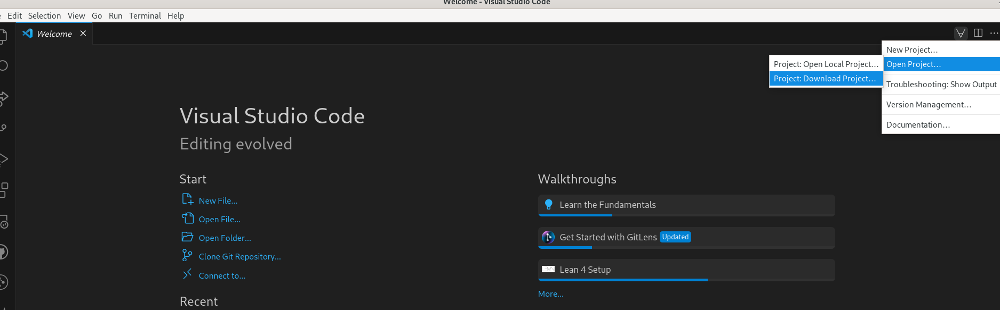
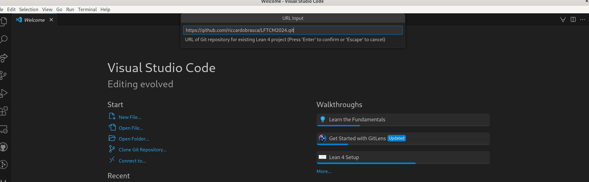
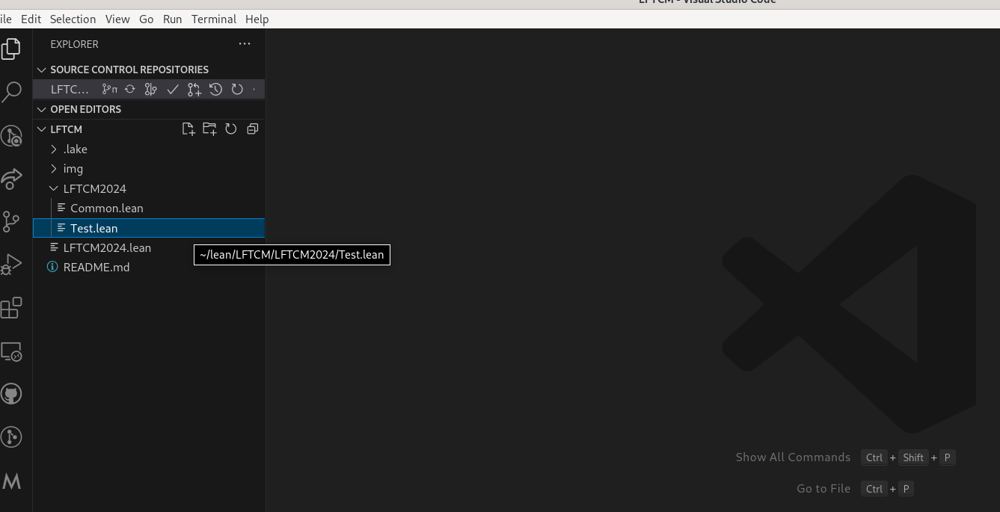
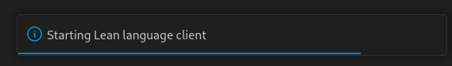
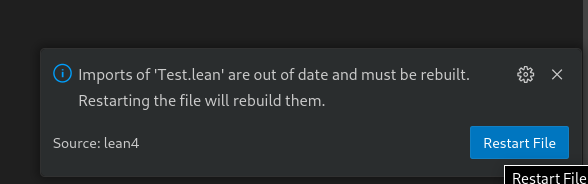

# Lean For The Curious Mathematician 2024

25-29 March 2024

This is the main repository for the conference [Lean For The Curious Mathematician 2024](https://conferences.cirm-math.fr/2970.html).

* All the files needed during the lectures are in the subfolder `LFTCM2024`. See below for the instructions to install everything you need.
* [Here](https://www.cirm-math.fr/Schedule/display.php?id_renc=2970) is the schedule of the conference.


## Installation

Note: to get this repository, you will need to download Lean's mathematical library, which takes about 5 GB of storage space.

* You have to install Lean, and two supporting programs: Git and VSCode (including the Lean4 extension). Follow these [instructions](https://leanprover-community.github.io/get_started.html) to do this. You do not have to follow the last step (creating Lean projects). Instead, use either VSCode or a terminal to get this repository.

### Get the Repository using VSCode

* Open Visual Studio Code.
* In the top-middle (or top-right) of the screen there is a Lean menu marked by `∀`.
  In it, choose `Open Project... > Project: Download Project`. If you don't see the `∀`, the Lean extension is not installed, go back to the previous step or ask for help.

  
* Type
  ```
  https://github.com/riccardobrasca/LFTCM2024.git
  ```
  and press enter (note that VSCode suggests you to download mathlib, that is *not* this repository).

  
* Choose a name for the folder where you want to have this repository (for example `LFTCM2024`).
  This downloads the project, including mathlib, and will take a bit of time.
* Press `Open Project Folder` when asked if you want to open the folder.
* If VSCode asks `Do you trust the authors of the files in this folder?` click `Yes, I trust the authors`.
* Open the file `LFTCM2024/Test.lean` using the explorer button in the top-right.
  
  
* VSCode will pause for a bit (10-40 seconds, depending on your computer), showing a `Starting Lean language client` pop-up.
  
  
* When the pop-up `Imports of 'Test.lean' are out of date and must be rebuilt.` appears, click on `Restart File` and wait a couple of seconds (this part should be very quick).
  
  
* Everything should be ready now. If you see a blue squiggle under `#eval`, Lean is running correctly. 

### Get the Repository using a terminal

* Open a terminal (I recommend `git bash` on Windows, which was installed as part of git in the first step).

* Use `cd` to navigate to a directory where you would like to create the `LFTCM2024` folder.

* Run the following three commands.
  ```
  git clone https://github.com/riccardobrasca/LFTCM2024.git
  ```
  ```
  cd LFTCM2024
  ```
  ```
  lake exe cache get!
  ```
  The last one downloads mathlib, and will take a bit of time
* On Windows, if you get an error that starts with `curl: (35) schannel: next InitializeSecurityContext failed` it is probably your antivirus program that doesn't like that we're downloading many files. The easiest solution is to temporarily disable your antivirus program.

* Run
  ```
  lake build +LFTCM2024.Common
  ```
  This should take less than 1 minute. If you get more than a few lines of output, then you're rebuilding Mathlib from scratch, which means that the previous step went wrong. You can quit the execution and ask for help.

* Launch VS Code, either through your application menu or by typing (note the dot!)
  ```
  code .
  ```
   MacOS users need to take a one-off
  [extra step](https://code.visualstudio.com/docs/setup/mac#_launching-from-the-command-line)
   to be able to launch VS Code from the command line.

* If you launched VS Code from a menu, on the main screen, or in the File menu,
  click "Open folder" (just "Open" on a Mac), and choose the folder
  `LFTCM2024` (*not* one of its subfolders).

* If VSCode asks `Do you trust the authors of the files in this folder?` click `Yes, I trust the authors`

* Test that everything is working by opening `LFTCM2024/Test.lean`.
  It is normal if it takes 10-40 seconds for Lean to start up.

* Everything should be ready now. If you see a blue squiggle under `#eval`, Lean is running correctly. 

### Update the repository

If you have already followed the steps above, and want to update the repository, open a terminal in your local copy of this repository (e.g. `cd LFTCM2024`) and then run
```
git pull
```
This gives you the new exercises.

### Error Lens extension

Optional: some users find it useful to download the `Error Lens` extension. This displays Lean messages directly in your source file.
To get it, in the left bar of VSCode, click on the `Extensions` button (4-th button), and search and install the extension `Error Lens`. It will start automatically.

## Alternative ways to use Lean

You can use Codespaces if you have trouble installing Lean locally. These work fine, but not as well as a locally installed copy of Lean.

### Using Codespaces

You can temporarily play with Lean using Github codespaces. This requires a Github account, and you can only use it for a limited amount of time each month. If you are signed in to Github, click here:

<a href='https://codespaces.new/riccardobrasca/LFTCM2024' target="_blank" rel="noreferrer noopener"></a>

* Make sure the Machine type is `4-core`, and then press `Create codespace`
* After 1-2 minutes you see a VSCode window in your browser. However, it is still busily downloading mathlib in the background, so give it another few minutes (5 to be safe) and then open a `.lean` file to start.

To restart a previous codespace, go to [https://github.com/codespaces/](https://github.com/codespaces/).
